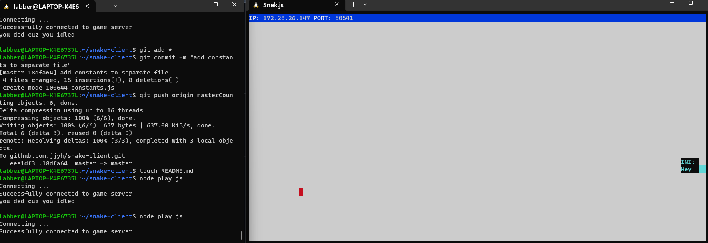

# Snake Client Project

Snake game is a very popular video game. It is a video game concept where the player maneuvers a dot and grows it by ‘eating’ pieces of food. As it moves and eats, it grows and the growing snake becomes an obstacle to smooth maneuvers. The goal is to grow it to become as big as possible without bumping into the side walls, or bumping into itself, upon which it dies.

This is simply a multiplayer take on the genre.

Before you can run this client, you will need to be running the server side which you can download and install from here. 

## Final Product

## Getting Started

### Set up
*Client side*
1. git clone the client files from this [repository](git@github.com:jjyh/snake-client.git)
2. Navigate to the directory where the client is, then type in command line: `npm install``

*Server side*
1. Follow steps inside the [snek server repo](https://github.com/lighthouse-labs/snek-multiplayer) to run the server side

### To play 
Both client and server need to be running in separate terminals  
  
*Client side*
1.  Navigate to the directory where the client is, then type in command line: `node play.js`` 

*"Sending Messages". Press 9 to send special message while playing game.*